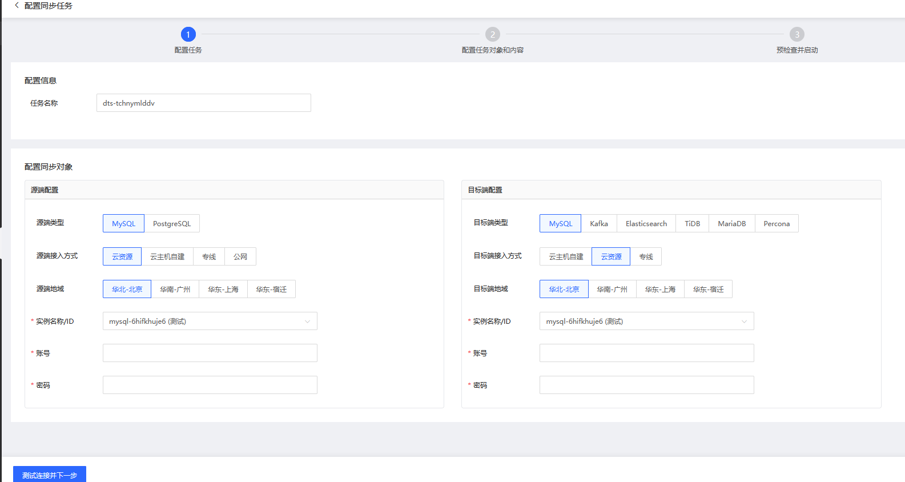

# MySQL同步至MySQL
DTS数据传输服务支持自建MySQL同步至云数据库 MySQL实例，数据的实时同步。
## 支持的源端和目标端数据库

|源数据库|目标数据库|
|-|-|
| &bull; 云数据库MySQL实例</br> &bull; 云主机自建数据库</br> &bull;通过专线连通的自建数据库 </br> &bull; 通过公网连通的自建数据库|&bull; 云数据库MySQL实例</br> &bull; 云主机自建数据库</br> &bull;通过专线连通的自建数据库|

## 前提条件
* 源数据库和目标数据库版本为5.5、5.6、5.7或8.0版。
* 已创建目标数据库，如未创建实例，请参考[创建云数据库 MySQL](https://docs.jdcloud.com/rds/create-instance)。
* 目标端实例的存储空间大于等于源端实例所占用的存储空间。
* 数据同步任务所在网络可访问源数据库、目标数据库。

## 账号权限要求

源数据库与目标数据库需要的权限如下：

```sql
GRANT SELECT ON `db`.* TO 'dbuser'@'%'
GRANT REPLICATION SLAVE,REPLICATION CLIENT ON *.* TO 'dbuser'@'%';
```

## 使用限制  

|类型|限制说明|
|-|-|
|字符集限制|仅支持如下字符集：utf8、utf8mb4、ascii、binary、latin1|
|全量同步限制|全量同步过程中不支持Alter Table、Drop Table、DDL|
|源库限制|&bull; 需要同步的表字段需要具有唯一性，否则可能导致同步失败或导致目标库数据被覆盖。</br> &bull; 源数据库需开启Binlog，且binlog为row格式|
|其他限制|&bull; 仅支持InnoDB和MyISAM引擎</br> &bull; 不支持外键约束</br> &bull; 只支持基础表和视图，不支持存储过程、函数、事件等对象</br> &bull; 相互关联的数据对象需要一起同步，否则会导致同步失败。</br> &bull;建议源和目标库的版本保持一致，或从低版本到高版本同步，不支持从高版本到低版本的数据同步|
|注意事项|&bull;DTS的延迟时间是根据同步到目标库的最后一条数据的时间戳和当前时间戳相比较得出，源数据库长时间未执行DML操作可能导致延迟信息不准|

## 操作步骤
1. 登录 [数据同步购买页](https://ddts-console.jdcloud.com/syncCreate),选择所需数据同步链路配置并进行购买。  

  |参数|说明|
  |-|-|
  |计费模式|支持包年包月和按配置计费。关于计费方式的选择，请参考[产品定价](https://docs.jdcloud.com/data-transmission-service/price-overview)|
  |地域|选择链路所在的地域 。
  |私有网络|选择实例所在的VPC和子网，需保证数据同步所在子网可访问源数据库和目标数据库。|
  |链路规格|选择需要的链路规格|
  |同步类型|选择需要的同步类型，当前仅支持单向同步|
  
2. 购买完成后，返回[数据同步列表页](https://ddts-console.jdcloud.com/syncList),等待链路创建完成后进行任务配置。
3. 点击操作列的**配置同步任务**，进入任务配置页面。配置源端目标端的相关信息。

   

 场景一：自建数据库或通过专线连接数据库同步到云数据库MySQL。
 
  1) 任务设置  
  
  |参数|说明|
  |-|-|
  |任务名称|&bull; 系统自动生成一个任务名称，用户可根据需求进行修改。</br>&bull; 任务名称支持1-64个字符|
  |执行时间|当前仅支持立即执行|
  
  2) 源端配置  
  
  |参数|说明|
  |-|-|
  |源端类型|选择MySQL数据库|
  |源端接入方式|选择公网。|
  |连接地址|输入源端实例的访问地址|
  |端口号|输入源端实例的服务端口号，默认为3306.|
  |账号|输入数据库访问的账号|
  |密码|输入该数据库账号对应的密码|
  
  3) 目标端配置
  
  |参数|说明|
  |-|-|
  |源端类型|选择MySQL数据库|
  |源端接入方式|选择云资源。|
  |源端地域|选择云数据库实例所在地域|
  |实例ID|选择目标端实例ID|
  |账号|输入数据库访问的账号|
  |密码|输入该数据库账号对应的密码|
 
 场景二：云数据库MySQL 同步到云数据库MySQL  
 
  1) 任务设置
   
  |参数|说明|
  |-|-|
  |任务名称|&bull; 系统自动生成一个任务名称，用户可根据需求进行修改。</br>&bull; 任务名称支持1-64个字符|
  |执行时间|当前仅支持立即执行|
 
  2) 源端配置 
  
  |参数|说明|
  |-|-|
  |源端类型|选择MySQL数据库|
  |源端接入方式|选择云资源。|
  |源端地域|选择云数据库实例所在地域|
  |实例ID|选择目标端实例ID|
  |账号|输入数据库访问的账号|
  |密码|输入该数据库账号对应的密码|
  
  3) 目标端配置
  
  |参数|说明|
  |-|-|
  |目标端类型|选择MySQL数据库|
  |目标端接入方式|选择云资源。|
  |目标端地域|选择云数据库实例所在地域|
  |实例ID|选择目标端实例ID|
  |账号|输入数据库访问的账号|
  |密码|输入该数据库账号对应的密码|
  
 
4. 配置完成后，点击 **测试连接并下一步** 。
5. 配置任务对象和内容以及高级配置。

   * 配置任务对象和内容。
   
   |参数|说明|
   |-|-|
   |同步步骤|支持结构同步、全量同步和增量同步。</br> 结构同步：将源端的表结构初始化同步到目标端。</br>全量同步：将源端的数据初始化到目标端。</br>增量同步：将同步期间的增量数据同步至目标库|
   |主键冲突检测|冲突报错：在同步过程中发现表的主键冲突时暂停任务并报错。</br>冲突覆盖：在同步过程中发现表的主键冲突时，忽略冲突覆盖写入。|
   |同步对象|在源列表中勾选需要同步的对象，然后点击“**>**”，移动到目标列表中|
   |映射名修改|&bull;  如需批量修改同步对象在目标端中的名称，点击目标端上方的**批量修改**按钮，进入批量修改弹窗进行映射名修改。详情查看[库表名批量映射](../Manage-Task-Object/Database-and-Table-Name-mapping.md)</br>&bull; 如需对单一表进行修改，则鼠标悬浮在需要进行修改的表名上，点击 **编辑**按钮，进入编辑弹窗。详情查看[单一库表名映射](../Manage-Task-Object/Database-and-Table-Name-mapping.md)|

   
   * 自定义配置
   
   |参数|说明|
   |-|-|
   |设置任务告警|如果需配置告警则选择是，默认为否|
   |任务状态异常告警|默认关闭，可手动选择是否开启|
   |任务延迟告警|默认关闭，可选择开启，如开启后则需要设置延迟大于多少的情况下进行告警|
   |告警接收人电话|输入需要接收告警的联系人电话，可支持添加多个告警接收人|
   |重试超时时间|当任务超时X分钟后触发重试功能|
   |重试时间间隔|任务重试的时间间隔|
   


6. 上述任务配置完成后，点击**预检查**，进行任务启动前的预检查。预检查通过后直接启动任务。如预检查未通过，请根据实际报错信息进行任务修改，修改完成后进行重新预检查。
7. 返回数据同步任务列表，任务进入**运行**状态。


