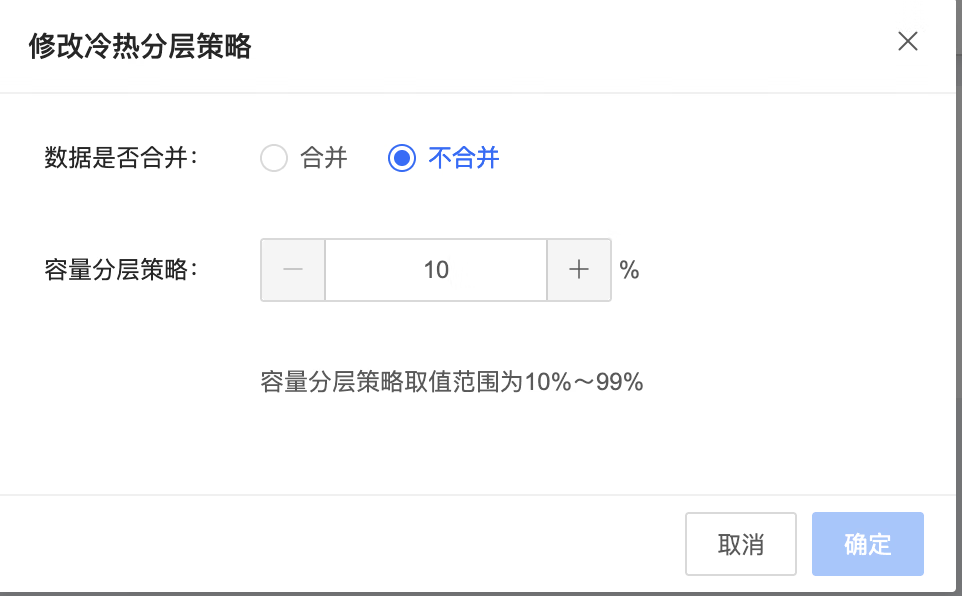

# 冷热数据分层存储
如果集群的数据量比较多，为了降低海量数据存储成本，京东云ClickHouse提供了冷热数据分层存储功能。用户可以把部分冷数据存放到成本较低的oss上，热数据还是放到分析型云数据库 ClickHouse 的本地盘，这样既可以满足云数据仓库 ClickHouse 数据查询性能，又能降低数据存储成本。

## 名词解析
* 热数据：访问频次较高或创建时间较近的数据，仍以集群创建时所选的云硬盘或本地盘为存储载体，支持数据高效访问。
* 冷数据：数据使用频次较低，可存储在冷数据盘即可降低数据的存储开销又可满足数据访问的需求。
* 冷热数据分层存储提供了三种数据移动方法，移动顺序是先移动满足TTL策略的PART，如果存储容量还超过界限，优先移动大PART，具体如下：
  * 存储容量策略：将新写入的数据存储在热数据盘中，提供高效查询。当热数据存储量达到业务使用阈值时，自动将热数据盘的数据移动到冷数据盘存储，从而释放热数据盘存储空间。
  * TTL分层存储策略：在默认存储策略基础上，添加TTL语句，实现将间隔时间之前的所有数据自动转移到冷数据盘中。
  * 手动方式将数据在冷热之间移动

## 注意事项
* 分析型云数据库 ClickHouse仅20.8及以上版本支持冷热数据分层存储功能。对于不支持的低版本，可以先将集群版本升级至20.8及以上版本，再进行冷热数据分层存储。

* 冷热数据分层存储功能开通时，实例会进行重启。

* 如果要使用冷热数据分层存储功能，必须在建表时添加SETTINGS storage_policy = 'hot_to_cold' 语句指定存储策略。

* 对于老数据的表可以使用 ALTER TABLE <tableName> MODIFY SETTINGS storage_policy = 'hot_cold' 语句变更存储策略。注：如果用户的老数据表结构如下

  ```
  create table tableA on cluster default (id int ,d date,dt datetime) engine=ReplicatedMergeTree('/clickhouse/tables/{shard}/tableA','{replica}',d,id,8192)
  ```


那么不支持变更表的存储策略。

* 存储策略一旦指定，后期无法更改。

* 冷热数据分层存储功能开通后，暂不支持关闭。

## 计费规则
* 热数据存储：购买集群后已经拥有了热数据存储空间，与购买集群的存储空间相同。
* 冷数据存储：采用按量付费模式。无需提前购买固定的存储空间，先使用，后付费，并按照实际使用的存储空间每小时计费一次。
计费公式：每小时费用=冷数据存储单价×冷数据存储使用量。
示例：若冷数据存储单价为0.0002元/GB/小时，19：00-20：00使用冷数据存储2000 GB，则总费用为：0.0002元/GB/小时×2000 GB×1小时=0.4元。20：00-21：00释放了500 GB冷数据存储空间，实际使用了1500 GB存储空间，那么20：00-21：00的总费用为：0.0002元/GB/小时×1500 GB×1小时=0.3元。

## 操作步骤

1. 登录 [分析型云数据库ClickHouse 管理控制台](https://jchdb-console.jdcloud.com)。创建集群时，在冷热分层配置中选择开启冷备存储。
    集群策略默认数据达到90%后，会自动触发冷数据分层机制，按 Data Part 的大小，优先将大的 Data Part 从本地盘转移到配置的 COS 盘上，直到数据量低于阈值。可按照实际需要配置冷热分层数据表，具体配置指令如下：ALTER TABLE <tableName>  MODIFY SETTINGS storage_policy = 'hot_to_cold'。
    
2. 若集群创建时未开启冷热分层服务，在集群创建成功后，可在集群列表选择操作 > 更多 > 开启冷热分层存储，或在实例详情 > 冷热数据分层>开启按钮，手动开启服务。

    

    

3. 确定开通后，实例会进行重启。待实例状态从冷热存储变更中变为运行中，即完成开通。

    

4. 配置好冷热分层后，可通过集群冷热数据分层详情页查看或调整热数据分层系数。

    

## 冷热分离数据移动方式
1. 开通冷热分层存储功能后，默认存储策略的相关参数如下表所示。

| 参数                | 说明                                                         |
| ------------------- | ------------------------------------------------------------ |
| move_factor         | 当热数据盘中的可用存储空间所占比例小于该参数时，自动将最早写入热数据盘的数据移动到冷数据盘存储。取值范围为大于0，小于等于1的浮点值。默认值为0.1，代表可用存储空间所占比例小于10%时，将自动进行数据移动。可以通过网页冷热分层策略进行修改。 |
| prefer_not_to_merge | 冷数据盘中的数据是否进行合并。取值范围如下：<br/>true：不合并。<br/>false：合并，默认值。 |

2.设置 TTL 分层存储策略
在默认存储策略的基础上，添加 TTL 语句，实现将间隔时间之前的所有数据自动转移到冷数据盘中。通过设置表级别 TTL 可以设置 Part 过期时间，对数据进行迁移，**表达式的计算结果必须为 Date 或 DateTime 数据类型**。 **需要依托某个 Datetime 或者 date 类型的字段，通过对这个时间字段的 INTERVAL 操作来表述 TTL 的过期时间。**对于 Part 移动特征， Part 的所有行必须满足移动表达式标准。
您可以参考如下语法添加 TTL 语句。可以将 TTL 设置为 TO DISK 'cold_disk'或者 TO VOLUME 'cold',效果相同,其中的名字可以通过 system.disks 和 system.storage_policies 系统表进行查看。

```
TTL 
 + INTERVAL 
 TO DISK 'cold_disk' 
```

参数说明
| 参数                | 说明                                                         |
| ------------------- | ------------------------------------------------------------ |
| time_column         | 日期或日期时间类型的列。 |
| number     | 间隔时间。常用单位有：Day、Week、Month、Year。 |

示例 以date列为依据，将90天之前的所有数据移动到冷数据盘。建表语句如下。
```
CREATE TABLE ttl_test_tbl
(
    `f1` String,
    `f2` String,
    `f3` Int64,
    `f4` Float64,
    `date` Date
)
ENGINE = MergeTree()
PARTITION BY date
ORDER BY f1
TTL date + INTERVAL 90 DAY TO DISK 'cold_disk'
SETTINGS storage_policy = 'hot_to_cold';
```
* 更改 TTL 分层存储策略
您可以更改 TTL 分层存储策略的日期或日期时间类型的列以及间隔时间。
#### 说明：
* 默认情况下，更改 TTL 分层存储策略后存量数据和新增数据全部按照新策略进行存储。
* 如果您不想更改存量数据的 TTL 分层存储策略，可以在更改 TTL 分层存储策略之前，执行 set materialize_ttl_after_modify=0; 语句。执行成功后，再更改 TTL 分层存储策略。存量数据按照原有策略进行存储，不发生改变。只有新增数据按照新策略进行存储。
* 更改 TTL 分层存储策略后，已经进入冷数据盘中的数据不会自动移动到热数据盘，可以进行手动移动。
您可以参考如下语法更改TTL分层存储策略。
```
ALTER TABLE 
 MODIFY TTL 
 + INTERVAL 
 TO DISK 'cold_disk'; 
```
参数说明
| 参数                | 说明                                                         |
| ------------------- | ------------------------------------------------------------ |
| table_name         | 表名。|
| time_column         | 更改后的日期或日期时间类型的列。 |
| number     |更改后的间隔时间。常用单位有：Day、Week、Month、Year。 |

3. 移动冷热数据盘的数据。
* 移动前查看当前 part 或 partition 所处位置：
```
select partition,name,table,disk_name,database from system.parts where active=1
```
* 找到需要移动的 part 和 partition 进行移动，语法如下：
```
ALTER TABLE table_name MOVE PART｜PARTITION  partition_expr TO VOLUME ' volume_name’;
```
* 移动热数据盘数据到冷数据盘。
```
ALTER TABLE 
MOVE PARTITION <partition>
     TO DISK 'cold_disk'; ALTER TABLE 
MOVE PARTITION <partition>
    TO VOLUME 'cold';
```
* 移动冷数据盘数据到热数据盘。
```
ALTER TABLE 
ON CLUSTER default MOVE PARTITION  
TO DISK 'default'; ALTER TABLE 
ON CLUSTER default MOVE PARTITION 
TO VOLUME 'hot';
```
4. 冷热数据盘上的数据
* 查看热数据盘上的数据
```
select * from system.parts where database = '<db_name>' and table = '<tbl_name>' and disk_name ='default' and active = 1;
```
* 查看冷数据盘上的数据
```
select * from system.parts where database = '<db_name>' and table = '<tbl_name>' and disk_name ='cold_disk' and active = 1;
```
5.查看磁盘空间
开通冷热数据分层存储功能后，您可以执行如下语句查看磁盘空间。
```
select * from system.disks;
```
返回结果如下：
```
┌─name──┬─path─────────────────┬─free_space─────┬─total_space ────┬─used_space─┬─keep_free_space─┐
│ cold_disk│ /clickhouse/data/data/disks/cold_disk/ │ 18446744073709551615 │ 18446744073709551615 │ 115312080698 │   0               │
│ default  │ /clickhouse/data/data/                 │ 201663209472         │ 207083249664         │ 5420040192   │   0               │
└─────┴────────────────────┴───────────┴───────────┴───────┴─────── ──┘
```
参数说明
| 参数                | 说明                                                         |
| ------------------- | ------------------------------------------------------------ |
|name       | 磁盘名称。取值范围如下。cold_disk：冷数据盘。default：热数据盘。|
|path       | 磁盘上的数据存储路径。 |
| free_space     |当前磁盘剩余可用空间。冷数据盘可用空间不受限制。 |
| total_space    |当前磁盘总空间。冷数据盘可用空间不受限制。 |
| used_space  |当前磁盘已经被使用的空间。 |
| keep_free_space |预留的空闲空间。 |