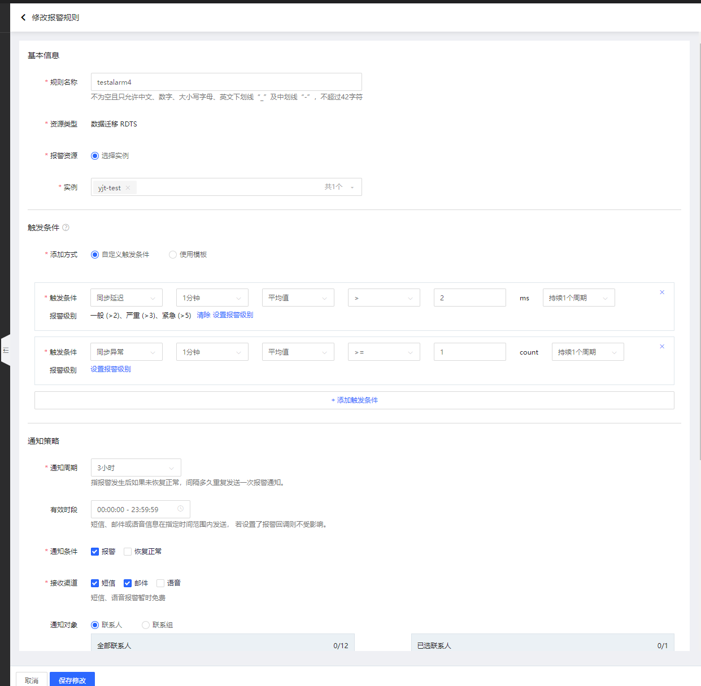
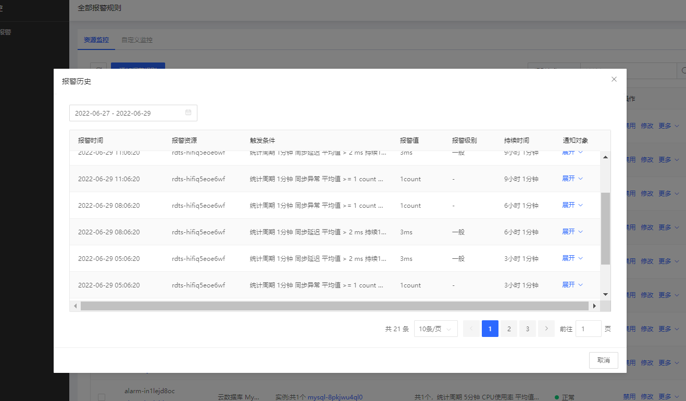

# 迁移的监控报警配置

当迁移任务创建成功后，您可以进一步配置增量延迟监控和同步中断异常监控。当任务创建完成后且为“待迁移”状态时，云监控将自动进行迁移监控，您可以这时继续设置报警信息。

## 设置入口

- RDTS产品中，任务列表->任务->操作->监控。下文以该入口进行操作说明。

- 云监控产品中，资源监控->Redis数据传输RDTS->任务列表->任务->操作->监控、报警规则

## 操作步骤

【Step1】进入迁移任务列表， 选择“待迁移”任务，点击“监控”操作

 
【Step2】进入监控页，可查看到对迁移过程监控的指标，包含 同步OPS、同步传输流量、同步延迟、同步异常。
 

 
【Step3】配置报警规则，点击添加报警规则

1、	同步延迟 报警设置，可配置ms级别的监控，RDTS上报的最小的延迟是2ms，配置大于等于2ms的监控，即可收到报警。
 

2、	同步异常 报警配置：异常的上报为0和1.  0为正常、1为异常。

3、在 全部报警规则 页面中，可查看历史报警监控
 
 

 
 
##  常见的异常问题

|异常问题| 建议处理方式 |
|:--:|:--:|
| RDTS与源端连接异常  |  重新检查源端链接的配置是否正确  |
| 目的端返回错误      |  重新检查目标端链接的配置是否正确  |
| RDTS与目的端连接异常  |  重新检查目标端链接的配置是否正确  |
| RDTS写aof文件失败 |      |
| RDTS写目的端失败  |      |
| RDTS保存rdb文件失败  |      |
| RDTS发送rdb失败  |      |
|  RDTS连接目的端超时  |      |
|  RDTS连接源端超时  |      | 
| RDTS接受rdb文件超时  |      | 
| 同步任务超时  |      |  
| 获取RDTS信息超时  |      | 
| RDTS启动失败  |      | 

