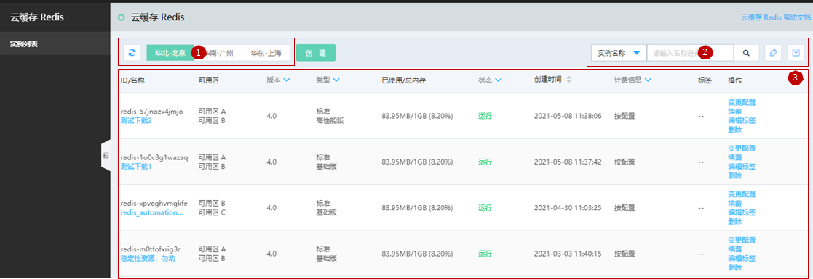
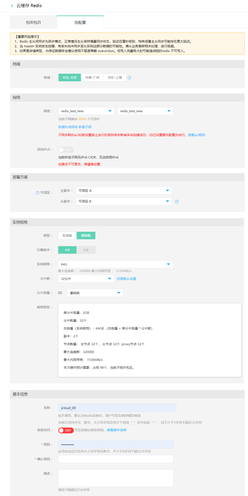
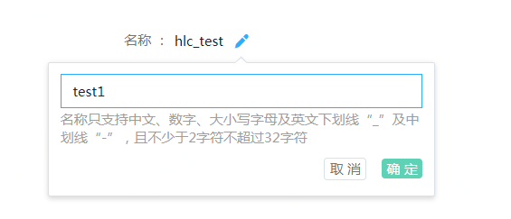

# 创建实例

您可以在云数据库Redis控制台或者通过API新建Redis实例，本文将为您介绍如何在控制台上创建Redis实例。若您初次使用云数据库Redis版，请先了解 [使用限制](../Introduction/Restrictions.md)     和 [Redis命令支持](../Getting-Started/Command-Supported.md)    。

##  创建实例
####  Step1 准备环境

1、登录京东云控制台。

2、在控制台页面中选择“网络> 私有网络”，新建私有网络用于对缓存实例进行安全网络隔离。

####  Step2 创建实例

1、登录 Redis 控制台。

**说明：**

-   区域1：该区域即为当前支持的Redis地域列表。需要在哪个地域创建实例，则单击即可进入至该地域的Redis实例列表。

-   区域2：搜索栏、标签栏、导出实例列表。

-   区域3：地域下的Redis实例列表。

2、在“实例列表”页面，点击“创建”按钮，跳转到新建实例页。

**说明：**

-   计费模式：云缓存Redis目前支持包年包月和按配置计费。

    -   若您有长期稳定的业务量需求，建议选择包年包月。

    -   若您是短期需求，期望用完可立即释放实例，建议选择按配置计费。

-   地域与可用区

    -   建议您选择与云服务器同一个地域，不同地域的云产品内网不通。

    -   建议主副本、从副本选择不在同一可用区，以便增强在发生可用区中断情况时的容错性。目前创建后暂不支持修改。

    -   网络：云缓存Redis所属网络，建议您选择与云服务器同一个地域下的同一私有网络。云Redis支持IPv6，但若当前所选子网不支持IPv6则无法启用IPv6。

-   实例规格：

    -   架构版本。标准架构、集群架构。二者均为2副本，主从架构。

    -   兼容版本。兼容 Redis 2.8、4.0。2.8版已暂停售卖，建议您选择4.0及以上版本。

    -   分片数和分片容量。您可根据业务需要自定义分片数和分片容量。

    -   实例规格预览。帮助您了解当前所购买的产品的结构和内涵。

-   实例名称/设置密码。支持免密访问，创建后可在实例详情中修改密码。

3、点击 立即购买 ，进入“订单确认”页面。

4、在“订单确认”页面，确认实例信息，并阅读《缓存Redis服务条款》。

5、在列表查看创建实例的完成状态

-   如果状态显示为“创建中”，则请耐心等待几分钟

-   如果状态显示为"运行"，则创建已完成

##  修改实例基本信息

实例创建成功后，实例名称和描述可以支持修改。用户在点击列表中名称一栏进入资源详情页，点击编辑按钮进行修改(资源描述信息操作方式相同)。

  1、登录Redis 控制台

  2、选择目标实例，点击实例名称进入实例详情页面

  3、点击名称右上角的修改按钮，输入新的名称，后点击确定保存

  4、修改描述和修改实例名操作方式相同

##  相关参考

-  [连接实例](Connect-Instances.md)

-  [Redis SLA](https://docs.jdcloud.com/cn/product-service-agreement/caching-redis-service-level-agreement-sla)

##  常见问题

**Q：创建实例时，直接返回创建失败。**

A：可能由于当前可用区资源已不足，您可再选择其它可用区进行尝试。

**Q：创建实例耗时多久？**

A：正常情况下实例规格越大、分片数越多，都会导致创建时间越长。例如，创建64G以下规格大约5分钟左右，128G集群版大约15分钟左右，如果超过2小时实例仍显示在创建中，请联系客服。

**Q：首次创建实例成功后，为何会占用内存？**

A：在公有云上，为保障数据安全新建的Redis数据库是会有占用一小部分内存的。例如，云上创建1个4G实例，在初始化完成后会占用500M左右内存，主要是缓冲内存和Redis进程本身运行需要的内存。缓冲内存包括客户端缓冲区、复制积压缓冲区、AOF缓冲区等；其中，客户端缓冲存储客户端连接的输入输出缓冲；复制积压缓冲用于部分复制功能；AOF缓冲区用于在进行AOF重写时，保存最近的写入命令。

**Q：redis proxy 是什么？**

A：proxy是代理，会承接客户端的请求，转发给redis，也会把redis的响应转发给客户端。

**Q：如何配置读写分离？**

A：目前Redis2.8、Redis4.0的标准版、Proxy集群版产品暂时不支持读写分离。

