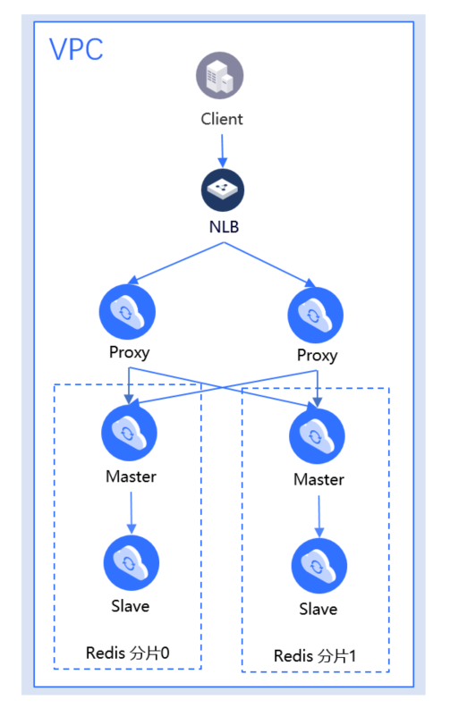

#  Redis Proxy特性说明

京东云缓存Redis 2.8和4.0版本都使用了代理（Proxy）,其主要实现了命令转发、限流等功能。通过对本篇文章的阅读，可以让您更清楚的了解我们的系统，有助于排查问题。

##  Proxy介绍

代理（Proxy）是Redis实例中的一个组件，每个实例独享数个Proxy。标准版有两个Proxy，集群版Proxy的数量和分片数量一致。每个proxy最大内网带宽48MB/s，可以和客户端建立的最大连接数为10000。

| Proxy能力 |  说明  | 
|   :--- | :---  | 
|  命令转发	|  Proxy根据客户端的请求对key做hash运算, 按照一定的规则转发到对应的底层Redis实例上，并将Redis的响应转发给客户端。	| 
|  流量限制	|  每个proxy最大内网带宽48MB/s，和客户端建立的最大连接数为10000。	| 
|  命令限制	|  Redis原生支持，但是由于某些原因，云缓存Redis无法支持的命令，会在Proxy被拦截。命令支持情况详见：  [Redis命令支持](../Getting-Started/Command-Supported.md) 	| 

##  Proxy的路由转发规则

-  单Key命令，Proxy会根据Hash算法计算Key所属的Slot，然后将请求发送给负责Slot的对应Redis分片

-  非计算性的多key命令(MSET、MGET、DEL等),  如果这些Key属于不同的Redis分片，Proxy会将这个命令拆分为多个命令，并发送给对应的Redis分片

-  计算性的多key命令，Proxy会判断涉及的key是否在同一个分片上, 如果不在同一个分片上会报错：
      
        ERR CROSSSLOT Keys in request don't hash to the same slot

-  事务类命令，Proxy会判断事务中命令涉及到的Key是否在同一个分片上，如果不在同一个分片上会报错：

        ERR CROSSSLOT Keys in request don't hash to the same slot

##  Proxy与Redis的连接

大部分情况，Proxy与Redis分片之间是通过建立的共享连接来处理请求的。但是在处理以下特殊命令时，Proxy会单独和Redis分片新建长连接，来处理命令。

| 类型 |  命令  | 
|   :---  |  :---  | 
|  阻塞类命令 | BLPOP、BRPOP、BRPOPLPUSH | 
|  持续响应类命令 | MONITOR、SUBSCRIBE、PSUBSCRIBE | 
|  事务类命令 | MULTI、EXEC、WATCH | 

