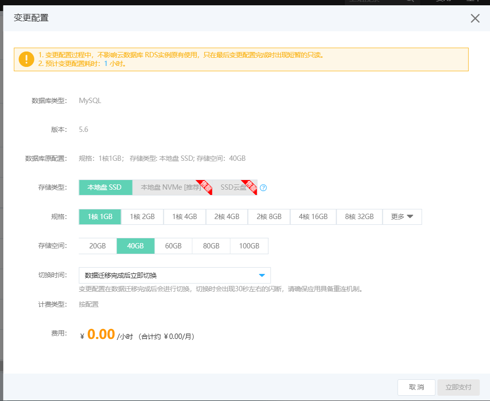

# 调整配置

用户可根据实际需求动态调整实例的CPU，内存及磁盘大小。 配置调整过程中，RDS 实例可正常使用，调整完成后，会有一个短暂的闪断，需保证应用应用服务有数据库重连机制。

- MySQL、Percona、MariaDB
  - 同时支持扩容和缩容
  
- SQL Server
  - 同时支持扩容和缩容
  - 为保证系统的稳定性，调整后的磁盘大小只能大于或等于原磁盘大小
  
- PostgreSQL 
  - 同时支持扩容和缩容
  - 为保证系统的稳定性，调整后的磁盘大小只能大于或等于原磁盘已使用的空间使用量，并额外需要预留一定的富余存储空间，避免在缩容完成后实例变只读
  
## 操作步骤
1. 入口有两个，分别为
    * 列表页：选择需要目标实例，点击 **操作** 这一列的 **更多 -> 变更配置/调整配置**
    * 实例详情页：进入到 **实例详情页** ，点击页面右上角的 **操作 -> 变更配置/调整配置**
2. 选择调整后的存储类型及配置
3. 选择需要进行切换的时间，可根据业务需求立即切换、指定时间点切换或迁移完成后延迟切换。
   >SQL Server不支持选择切换时间  

4. 点击 **确认** 执行调整配置。
    
   
