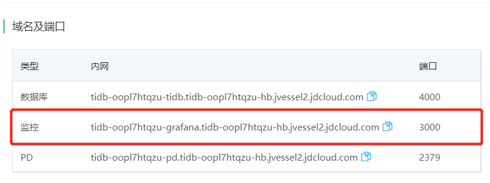

# 查看监控
在分布式数据库TiDB 的控制台，可以通过云监控查看多项数据库关键指标，定位系统的问题所在，进行相应的系统优化。 控制台的云监控可支持：
- 数据库集群级别的关键指标，例如每秒事务执行数，每秒查询数等。
- 集群中单个节点的关键指标，例如CPU，内存等。

此外，对于高级用户 TiDB 实例还支持查看 TiDB 自带的原生监控。 TIDB 的原生监控提供了上百个监控指标，可更全面的查看分析集群的整体状态。

## 一. 云监控
1. 登录 分布式数据库TiDB 管理控制台。
2. 选择目标实例，并点击进入实例详情页。
3. 选择 **监控** 标签，查看 TIDB 的关键监控项。 
4. 可以选择 **实例** 或 **节点**，查看相应的指标。
5. 默认显示的是 1小时 维度的监控数据，同时也可以选择 6小时，12小时，1天，3天，7天，14天的维度。

## 二. 原生监控
1. 登录 分布式数据库TiDB 管理控制台。
2. 选择目标实例，并点击进入实例详情页。在 **域名和端口** 部分，查看并记录 **监控** 的域名和端口。

3. 在和TiDB 实例处于同一VPC的云主机中，打开浏览器，输入步骤2 的域名和端口，例如：tidb-axbjt980b1-grafana.tidb-axbjt980b1-hd.jvessel2-test.jdcloud.com:3000
4. 浏览器中显示Grafana的登录界面，默认的用户名和密码均为: admin 。

> **注意**
> 
> 1. 为安全起见，建议修改admin账号的密码。
> 2. admin 的密码无法重置，修改后请务必妥善保管。

5. 登录后，点击左上方 **Home** 链接，可看到如下列表。

6. 选择需要看的信息，即可查看详细的监控指标。 各个监控指标的详细说明，可以参考[官方文档](https://docs.pingcap.com/zh/tidb/stable/grafana-overview-dashboard)

