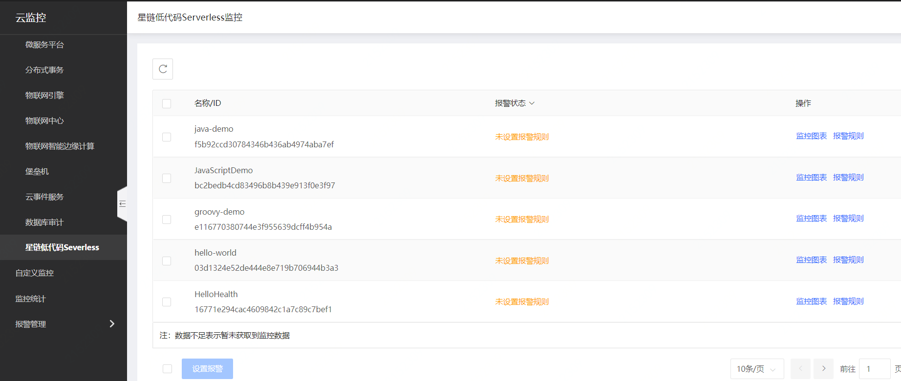

# 监控
  星链平台会对用户部署的VMS服务进行监控，并采集相关监控数据，用户可以在云监控中查看监控
  指标数据，同时可以根据情况配置告警规则，触发报警时相关用户会收到报警信息(邮件、短信等)。
  
  目前监控指标有：
    
    "http请求成功"，"http请求失败"，"http请求耗时"，
    "kafka接收消息"，"kafka接收消息失败"，"Kafka发送消息"，"Kafka发送消息失败"
    "Job执行成功次数","Job执行失败次数"
    
## 监控查看

* 在控制台"云服务" 列表下 找到 "监控运维"  - “云监控”
  

* 进入"云监控"平台，左侧菜单找到"资源监控" - "星链低代码Serverless"
  在监控主页面可以看到您的监控资源：VMS
  

* 点击需要查看的VMS名称后的 "监控图表" 按钮，进入监控图表，可以查看对应时间段的监控数据
  

## 监控报警配置
* 点击监控资源后的 "报警规则"，进入监控报警规则配置页面， 可以查看已经配置的监控规则列表
  

  

* 点击 "添加报警规则"，进入监控报警规则创建页面， 根据需要进行报警规则配置，同时选择需要接收报警的人员，
  具体配置说明详见：报警规则配置(https://docs.jdcloud.com/cn/monitoring/add-rule-in-batches)
  
