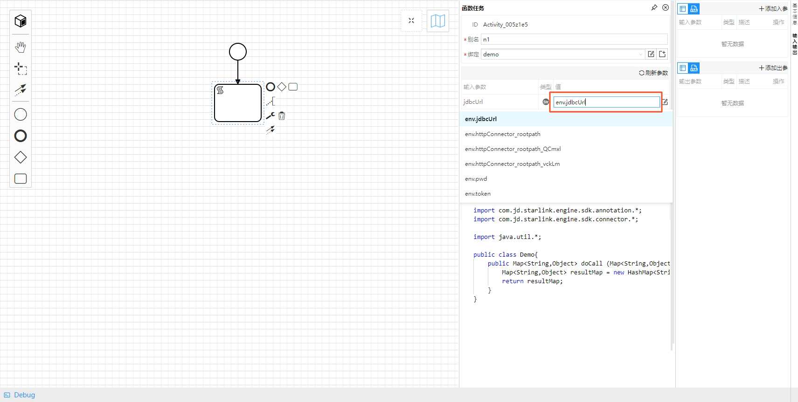

# 环境变量
VMS开发及运行过程中，对于不同环境下需要不同的配置项值，支持通过配置及使用环境变量的方式实现，比如VMS中定义的某个数据源，测试环境和生产环境的数据源地址不同，即可使用环境变量。
## 新建环境变量
1. 点击VMS Studio左侧导航菜单配置项-环境变量，打开环境变量页签
2. 点击环境变量页签右上角“新建”按钮  
  
3. 编辑环境变量列表新增行数据，完成环境变量新建
## 编辑环境变量
1. 点击VMS Studio左侧导航菜单配置项-环境变量，打开环境变量页签
2. 在环境变量列表直接选择编辑想要修改的数据即可  

## 删除环境变量
1. 点击VMS Studio左侧导航菜单配置项-环境变量，打开环境变量页签
2. 在环境变量列表找到想要删除的环境变量数据，点击该行数据操作列的删除按钮完成删除操作  

## 使用环境变量
### 在连接器/触发器/数据源配置中使用环境变量
以`@环境变量key@`格式引用，如`@jdbcUrl@`。  

### 在函数中使用环境变量
在BPMN函数中，为函数任务或服务任务参数赋值时使用环境变量，格式为`env.环境变量key`，如`env.jdbcUrl`。  

在Java/Groovy函数中，可以通过SDK提供的`@EnvValue`注解注入依赖的环境变量，具体用法参考[平台SDK](SDK.md)。  
