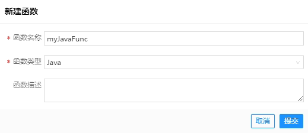
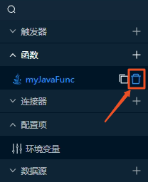
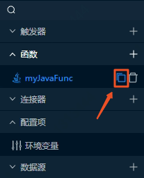
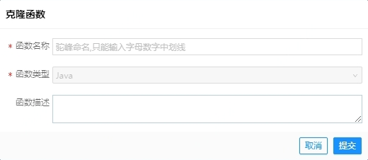

# 开发函数
函数和我们平常理解计算机语言的函数几乎没有差别，只是在VMS中函数不仅仅可以是一段Java、Groovy或者JavaScript代码，也可以是一个标准的BPMN流程图。函数包括输入输出以及函数体，输入输出需在函数编辑区的表单中配置，函数体则可以直接编辑代码或者通过绘制BPMN图实现。Function默认单例。  
## 创建函数
1. 点击星链低代码平台-Studio左侧资源库函数旁边的“+”按钮
2. 输入函数基本信息
- 函数名称：必填项。建议使用小驼峰的命名方式，只支持输入字母、数字和中划线，不支持数字开头。  
- 函数类型：必选项。所有的VMS都支持BPMN函数，另外只支持本VMS本身的语言类型，比如JAVA的VMS只支持JAVA和BPMN两种函数。  
- 函数描述：非必填。  

3. 点击“提交”完成函数创建
## 修改函数
函数主要包括基本信息、出入参以及函数体，其中基本信息可编辑的包括函数描述、是否事务函数以及事务函数关联数据源等信息，如果函数开启事务，则必须配置关联一个数据源，出入参包括函数输入、输出参数定义，主要是对参数名及参数类型的定义，支持多层级嵌套参数结构，参数类型目前支持int32、int64、float、double、boolean、object、list以及string等8种类型。  
函数编辑页左侧面板是函数体编辑区，右侧面板包含两个页签，分别是基本信息和输入输出。对于非BPMN函数，函数体代码会自动预置包含一个入口方法doCall，出入参均为map，右侧函数出入参面板中定义的一级参数均作为doCall方法出入参map的key一一对应。  

## 删除函数
1. 将鼠标浮到资源库的对应的函数上时会出现删除的按钮  

2. 点击删除即可完成函数删除
## 克隆函数
1. 将鼠标浮到资源库的对应的函数上时会出现克隆的按钮  

2. 点击克隆
3. 输入新的函数名  

4. 点击“提交”即可完成函数克隆
## 在线调试
函数支持在线调试，开发者可以在函数的编辑页下面的在线调试功能区域内进行调试，调试默认环境是测试环境。
1. 在函数编辑页，点击左下角“Debug”按钮打开调试功能区
2. 在“执行参数”页签下输入函数请求参数（JSON格式）
3. 点击左侧Debug执行按钮，等待Debug执行结束

4. 在Debug过程中，“执行日志”页签会输出Debug日志，方便开发者查阅日志。Debug执行成功后，“执行结果”页签会输出最终的执行结果  


## Java函数
### 日志打印
支持Java函数中打印日志，用法参考[平台SDK](SDK.md)。
### 调用连接器
支持Java函数中调用连接器，用法参考[平台SDK](SDK.md)。
### 调用其他函数
支持Java函数中调用其他函数，用法参考[平台SDK](SDK.md)。
### 获取环境变量
支持Java函数中获取环境变量，用法参考[平台SDK](SDK.md)。
## JavaScript函数
### 日志打印
支持标准的console.log()、console.info()、console.debug()等。
```JavaScript
function doCall(args) {
    console.log("doCall execute")
    return {}
}

export {doCall}
```
### 调用连接器
直接通过内置对象runtime来获取对应连接器，然后通过execute方法进行调用。调用DB及HTTP连接器代码参考如下：  
```JavaScript
function doCall(args) {
    //使用引擎内置对象runtime进行调用,rpc方法入参为HTTP Connector名称，execute方法入参为HTTP方法名、方法入参
    // 调用HTTP连接器 可以设置 query,path, header, cookie,body  等参数  注意 map 的 key 必须以这几个为key
    var httpReq = [
                    {
                        'query':{'dtype':'json','key':'08e92ae4949756ba4fdef17f2a78b29f'}
                    }
                  ]
    // juheGoodBook 是要调用的http 连接器名称  catalog 要调用连接器里的方法  httpReq 入参
    let resultHttp = runtime.rpc('juheGoodBook').execute('catalog',httpReq)
    // 获取响应头
    var resHeader = resultHttp.headers
    // 获取响应体
    var resBody = resultHttp.body
    console.log("调用 http juheGoodBook catalog 返回 响应头 信息：", JSON.stringify(resHeader))
    console.log("调用 http juheGoodBook catalog 返回 响应体 信息：", JSON.stringify(resBody))


    //使用引擎内置对象runtime进行调用,db 方法入参为db Connector名称，execute方法入参为db方法名、方法入参
    let resultDb1 = runtime.db('mysqlConnector').execute('selectCount',[])
    console.log("调用 db mysqlConnector selectCount 返回 信息：", resultDb1)
    var dbReq = [
                    {
                        'pin':'zhangshanpin1',
                        'realName':"zhangsan1",
                        'status':'0',
                        'idType':'0',
                        'idNo':'011111',
                        'mobile':'18500000001'
                    }
                  ]

    let resultDb2 = runtime.db('mysqlConnector').execute('addUser',dbReq)
    console.log("调用 db mysqlConnector addUser 返回 信息：", resultDb2)
    return {'resultCode':"ok"}
}

export {doCall}
```
### 调用其他函数
直接通过内置对象runtime来获取对应函数，然后通过execute方法进行调用。代码参考如下：  
```JavaScript
function doCall(args) {
    // 调用其他函数示例
    var funcReq = [
                    {
                        'param1':'1111',
                        'param2':"2222"
                    }
                  ]
    // elasticJobJsFunc 被调用函数名称  funcReq 被调用函数入参              
    let funcResult = runtime.function('elasticJobJsFunc').execute(funcReq)
    console.log("调用 function elasticJobJsFunc 返回 信息", JSON.stringify(funcResult))
    return {'resultCode':"ok"}
}

export {doCall}
```
## Groovy函数
参考Java函数。
## BPMN函数
参考[BPMN](BPMN.md)。
