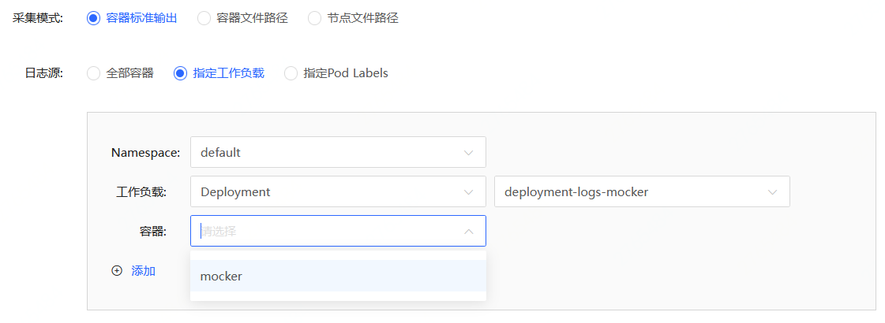
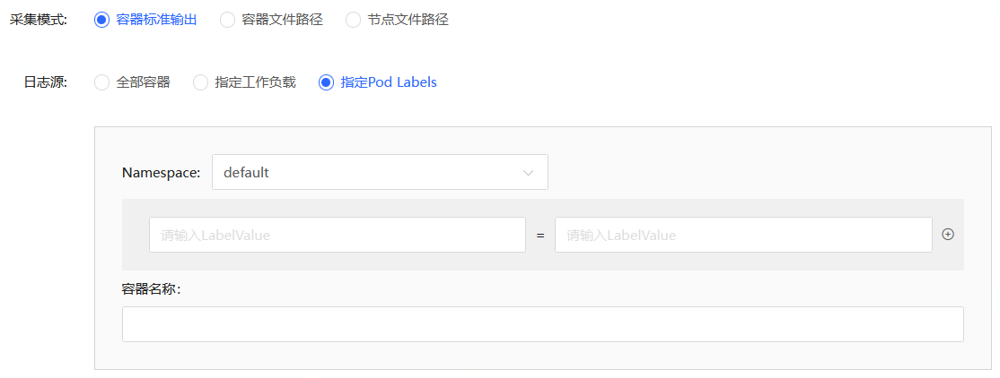
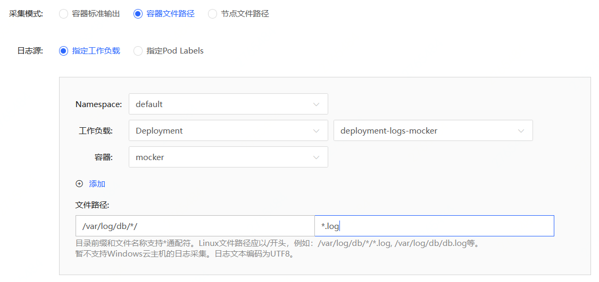

# 业务应用日志源设置

## 1. 概述

业务应用日志是指用户在京东智联云上部署的业务应用所产生的日志。日志内容和日志格式由用户自己定义。

用户无需手动安装日志采集agent，只需要在日志源设置中选择需要采集的云主机或k8s集群，日志采集agent将会自动安装。

业务应用日志支持投递至多种类型的目的地，默认采集至日志服务的日志主题中。也可将日志投递至控制台的云ES和云Kafka中，或自建ES和自建Kafka中。

## 2. 操作步骤

### 2.1 云主机

**业务应用采集配置**

1. 登录日志服务控制台，点击【创建日志配置】，或进入指定日志集内，点击左侧导航栏中的【新建主题】。

2. 完成日志集和日志主题的设置。

3. 点击【下一步】进入【日志源设置】页面。

4. 【日志来源】选择业务应用。

5. 【日志源类型】选择云主机。

6. 【采集状态】默认打开，用户也可以关闭。关闭后不采集日志。

7. 【日志路径】填写所需采集的业务应用的日志的路径和文件名，路径支持“/\*/”或“/\*/abd/\*/"的通配，不支持“/\*\*/”的通配，文件名支持\* 的通配。Linux的文件路径应该以/开头。日志文本的编码为UTF8。

8. 【采集实例】根据用户自身需求选择实例，或者对应的高可用组和标签。

9. 如果用户的业务应用日志是多行日志，则需要设置首行正则匹配的规则；首行正则遵循 **POSIX Extended Regular Express** 正则表达式 ，示例如下：
   
   日志首行基本上以时间格式开头，如java异常堆栈日志数据

```
2020-07-08 23:58:45.382 [INFO]  xxxxxxxxxxxx
    at xxxxxxxxxxxxxxxxxxx
    at xxxxxxxxxxxxxxxxxxx
    at xxxxxxxxxxxxxxxxxxx
2020-07-08 23:58:55.582 [INFO]  xxxxxxxxxxxx
    at xxxxxxxxxxxxxxxxxxx
    at xxxxxxxxxxxxxxxxxxx
    at xxxxxxxxxxxxxxxxxxx    
```

可以使用正则表达式进行匹配，不支持 ‘\d’ 方式进行数字匹配：

```
^[[:digit:]]{4}-[[:digit:]]{2}-[[:digit:]]{2}
```

预期结果是将以上数据分割成两条日志，每条日志的开头匹配年月日。

注：正在表达式相关语法可参考：[正则表达式](https://www.cnblogs.com/crunchyou/p/4877427.html)


**业务应用高级配置**

1. 【高级配置】默认关闭。打开高级配置后，可将日志直接从agent端投递至指定ES或Kafka中。

2. 若用户只有投递至ES或Kafka的需求，可以关闭【投递至日志主题中】，就不会在日志服务中存储对应的日志数据。也无法使用日志监控等功能。

3. 若业务应用日志的目的地是Kafka，则需要设定brokers，topic，以及是否压缩投递。压缩投递支持snappy和gzip格式。云Kafka会自动获取brokers。

4. 若业务应用日志的目的地是ES，则需要设定ES访问域名和索引前缀。云ES会自动获取访问域名。


### 2.2 k8s容器

支持对k8s容器内服务或集群节点路径文件的日志发送至云日志系统中，日志采集Agent会在集群内以DaemonSet的形式运行，并根据用户设置的采集配置从日志源中采集日志数据。

1. 登录日志服务控制台，点击【创建日志配置】，或进入指定日志集内，点击左侧导航栏中的【新建主题】。

2. 完成日志集合日志主题设置。

3. 点击【下一步】进入【日志源设置】页面。

4. 日志来源选择【业务应用】。

5. 日志源类型选择【k8s容器】。

6. 【采集状态】默认打开，用户也可以关闭。关闭后不采集日志。

7. 【采集实例】需要从当前账号下的k8s集群中选择一个，可通过地域进行筛选。

8. 【采集模式】支持容器标准输出、容器文件路径、节点文件路径三种模式。
   
   **容器标准输出**
   
   采集集群内任意服务下的容器日志，仅支持Stderr和Stdout的日志。
   
   【日志源】支持从全部容器、指定工作负载、指定Pod Labels的容器中采集日志。
   
   （1）全部容器：可设置从所有Namespace或指定Namespace中的所有容器中采集日志。
   
   
   
   （2）指定工作负载：从指定的Namespace中选择工作负载中采集日志，需要指定工作负载的类型、工作负载名称、容器名称，支持选择多个。
   
   
   
   （3）指定Pod Labels：选择Namespace，设置Pod Labels的key-value，容器名，从具有符合Pod Labels键值条件的容器中采集日志。
   
   

**容器文件路径**

从所选容器的指定文件路径中采集日志数据。

【日志源】支持配置指定工作负载或指定Pod Labels。

（1）指定工作负载：需要选择Namespace、工作负载、容器，允许配置多个，并设置容器内采集的文件路径地址，分为目录前缀和文件地址，目录和文件均支持使用\*通配符。



（2）指定Pod Labels：选择Namespace，设置Pod Labels的key-value，容器名，并设置容器内采集的文件路径地址，从具有符合Pod Labels键值条件的容器指定文件路径中采集日志。文件路径地址同样分为目录前缀和文件地址，目录和文件均支持使用*通配符。


**节点文件路径**

从节点的指定文件路径中采集日志，文件路径地址同样分为目录前缀和文件地址，目录和文件均支持使用*通配符。


## 3. 注意事项

- 当前版本仅支持采集Linux云主机和k8s集群工作负载模式的日志。
- 采集实例用户选择实例维度时，最多支持选择30台云主机，支持跨地域选择。
- 采集实例用户选择高可用组维度时，不受数量限制，高可用组内有多少云主机就采集多少，高可用组内后续新增的云主机的日志也会被采集，支持跨地域多选。
- 采集实例用户选择标签维度时，不受数量限制，标签内有多少云主机就采集多少，没有地域限制，标签内后续新增的云主机的日志也会被采集。
- 若高级配置中设置的目的地为自建ES或自建Kafka，则目的地ES或目的地Kafka前方的地域没有实际意义。
- 如果您使用的子账号没有被授予资源权限，在配置k8s日志时将无法加载出Namespace、工作负载、容器的列表信息，无法指定未授权的资源采集日志，需要与k8s产品主账号联系人取得联系，给子账号授予权限后再进行日志配置。
- k8s容器日志为了方便使用时检索和排查问题，除原始的日志内容以外，系统默认会携带容器场景的元数据（例如产生日志的容器ID等）一起上报至日志服务，并内置了一些字段用于记录这些信息，预置的字段如下：

| 字段             | 含义                    |
| -------------- | --------------------- |
| cluster_id     | 日志所属的集群 ID。           |
| container_name | 日志所属的容器名称。            |
| image_name     | 日志所属容器的镜像名称 IP。       |
| namespace      | 日志所属 pod 的 namespace。 |
| pod_uid        | 日志所属 pod 的 UID。       |
| pod_name       | 日志所属 pod 的名字。         |
| pod_ip         | 日志所属 pod 的IP。         |
| node_ip        | 日志所属节点的IP。            |
| node_name      | 日志所属节点的名称。            |
| file_path      | 日志文件路径。               |
| content        | 日志内容。                 |
