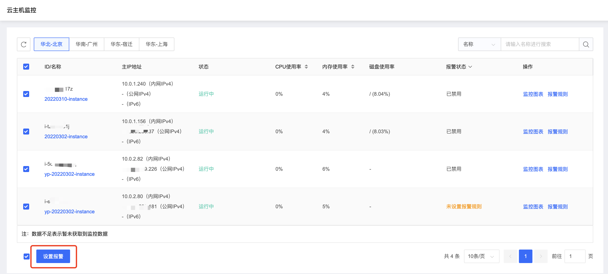
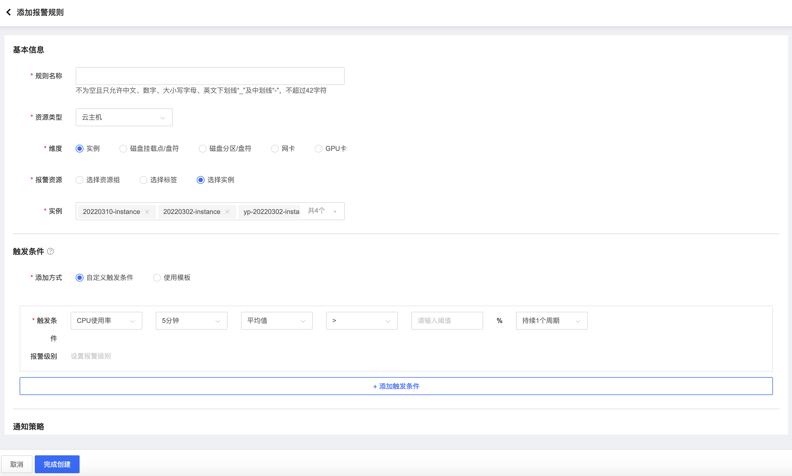
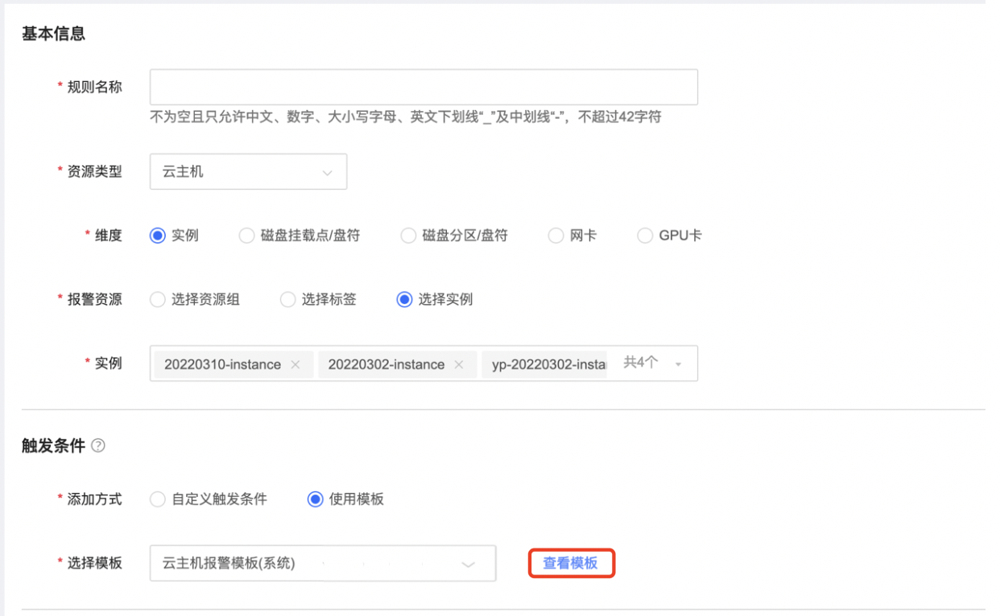
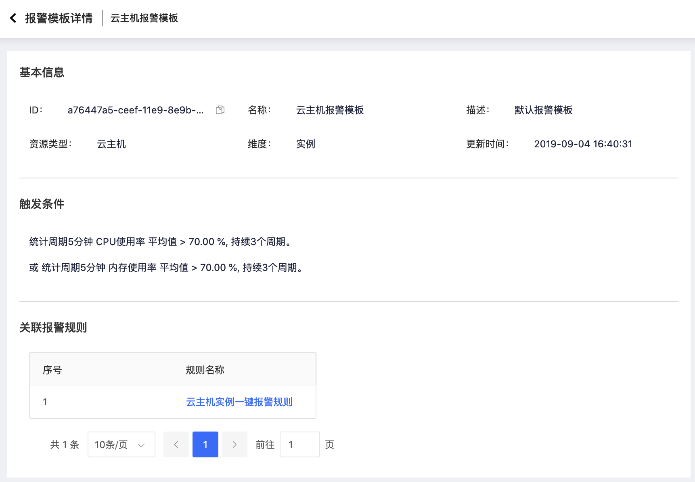
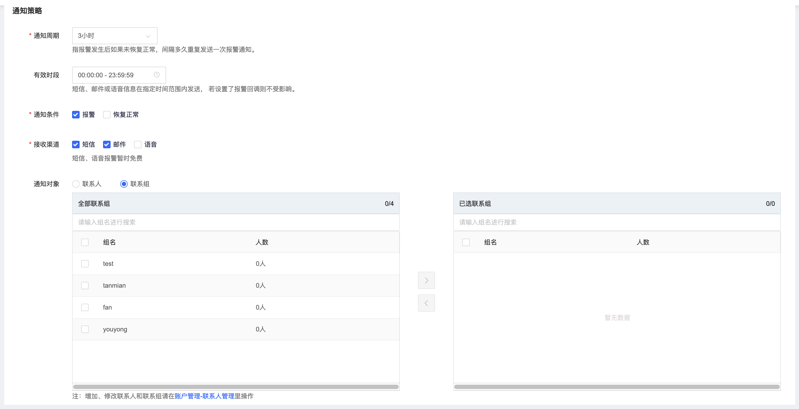
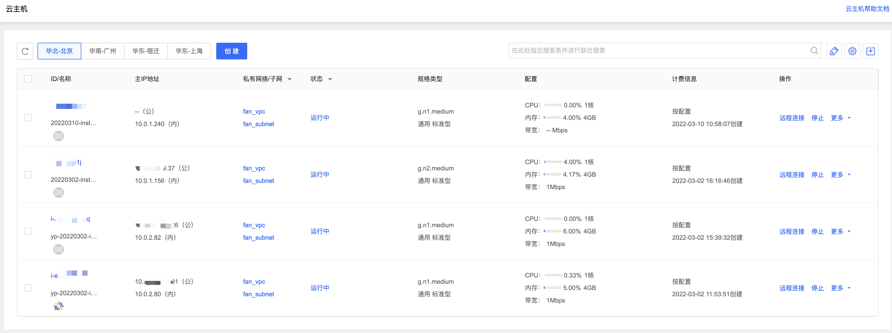
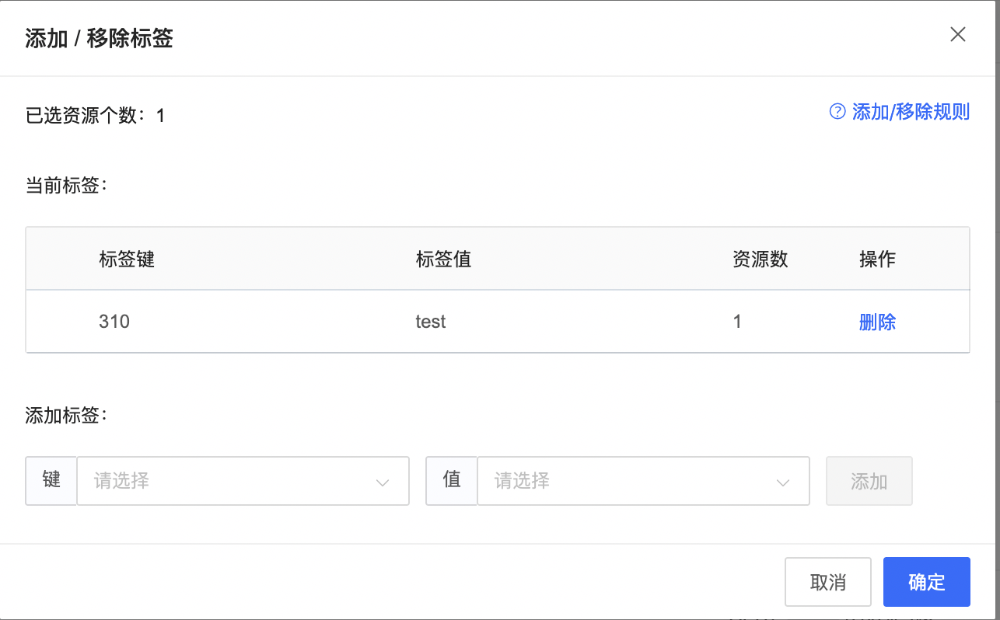
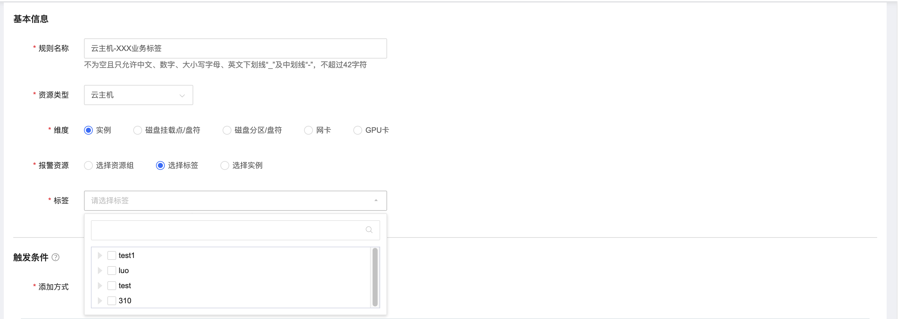

# 添加报警规则

报警策略配置主要包括：监控的资源、报警触发条件和通知策略三个部分。主要概念如下：

- 监控资源：支持配置【资源组】、【标签】或【实例】。资源组和标签满足动态和大批量资源的场景， 只要关联该资源组或标签的资源自动被该报警规则监控；指定实例，最多可支持100个实例。
- 触发条件： 配置指标报警的触发条件，包括：监控指标、统计周期、统计方法（最大值、平均值、最小值、求和值）、计算方式（>、\>=、<、<=、==和!=）、阈值和持续周期等各项。比如监控项为CPU利用率、统计周期为5分钟、统计方法为最大值、计算方式为>、阈值为80%、持续周期为2个周期，则表示：每5分钟收集一次CPU利用率的数据，若某台云主机的CPU利用率的最大值连续两次大于80%则触发报警。
- 通知策略：当触发告警时，以什么方式（短信、邮件、语音）通知给谁（用户组或用户），以及一些高级配置，包括报警回调、有效通知时段等。

## 操作指南

添加报警规则支持[批量资源添加](add-rule-in-batches#user-content-1)、[指定资源添加](add-rule-in-batches#user-content-2)、[基于标签添加](add-rule-in-batches#user-content-3)和[基于资源组添加](add-rule-in-batches#user-content-4)四种方式。以【云主机】为例具体操作分别如下：

### 批量添加报警

1. 登录[云监控控制台](https://cms-console.jdcloud.com/overview)。点击左侧菜单目录【资源监控】-【云主机】，进入云主机监控列表。 
   

2. 选中需要批量设置报警的云主机，点击表格下方的“设置报警”按钮，进入添加报警规则页面。  
     
     

3. 按照以下步骤配置信息  
   1）基本信息：设置规则名称，确认资源类型和已选中的实例信息。  
   2）触发条件：支持自定义添加，也支持绑定已有的模板信息。

   - 自定义添加：选择监控项、统计周期、统计方法、计算方式、阈值、持续周期，同时可根据需求配置报警级别。  若需配置多个触发条件，点击“添加触发条件”按钮即可配置。
         
      
   - 使用模板：切换至“使用模板”选项，点击下拉框，选择需要使用的模板，若需详细了解模板的详情信息，可点击“查看模板”字样，打开模板详情。  
       
     

   3）通知策略：  

   - 通知周期：表示如果资源一直处于告警状态，未恢复正常，间隔多久发送下一次通知。提供5分钟、10分钟、15分钟、30分钟、1小时、3小时、6小时、12小时和24小时几种选项。
   - 有效时段：报警短信和邮件信息仅在指定时间范围内发送，默认是全天都发送。
   - 通知条件：提供“报警”和“恢复正常”两种场景，默认仅报警状态发送，必须要指定通知条件。
   - 接收渠道：提供“短信”和“邮件”两种选型，默认都发送，可根据需要选择。  
   - 通知对象：支持选择联系人或联系组。添加联系人和联系组击选择框底部的“账户管理-联系人管理”进入用户中心进行配置。  
   - 报警回调：当资源发生告警时，京东云主动按照您配置的URL地址和POST参数进行回调。  
       
     

4. 点击页面底部的“完成创建”，则支持添加报警规则，点击“取消”按钮， 放弃本次操作。

#### 指定资源添加报警

1. 登录[云监控控制台](https://cms-console.jdcloud.com/overview)。点击左侧菜单目录【资源监控】-【云主机】，进入云主机监控列表。 
   
2. 选中需要设置报警的云主机，点击操作列下的“报警规则”按钮，进入对应云主机实例的报警规则列表页面。  
   
3. 点击“添加报警规则”按钮，进入添加报警规则页面
    
4. 配置规则名称、触发条件和通知策略（同批量设置报警规则) ，点击“完成创建”按钮即可。

### 基于标签添加报警

标签作为资源的分组标记，若创建报警规则时，选择标签这类分组，则报警规则对这类分组生效。后续标签分组下新增资源，无需手动规则即可关联报警。

#### 添加标签（以云主机为例）  

前提：云主机实例状态需为“运行中”或“已停止”。

1. 登录[京东云控制台](https://console.jdcloud.com/)，点击顶部菜工具栏【云服务】-【弹性计算】-【云主机】，进入云主机实例列表页面。
   
2. 选择需要配置标签的地域；在实例列表中选择编辑标签的实例，确认其状态为“运行”或“停止”状态。  
3. 单台操作：点击操作->更多->编辑标签按钮。  
   
4. 在弹出的“编辑标签”弹窗里，可根据已有标签直接下拉选择或者根据输入进行模糊匹配后选择对应标签键/值（Key-Value）进行添加标签，点击"添加"则将显示在当前标签内。  
5. 单击"确定"，将按照当前标签内显示情况完成编辑标签。

#### 配置报警    

1. 登录[云监控控制台](https://cms-console.jdcloud.com/overview)。点击左侧菜单【报警管理】-【全部报警规则】，进入全部报警规则列表页面。  

    

2. 点击“添加报警规则”，进入添加报警规则页面
    

3. 基本信息：配置规则名称，资源类型选择“云主机”，报警资源选择“选择分组”，在标签下拉框中选择需要配置报警的标签分组。  
   

4. 触发条件、通知策略相关配置同“批量配置报警规则”。

5. 完成以上配置后，点击“完成创建”操作，创建成功后在全部告警规则列表中可看到刚添加的规则。  

   **注：** 通过此方式配置的报警规则，后续新增资源仅需添加对应的标签，无需手动添加规则即可关联报警。

       

### 基于资源组添加报警

标签作为资源的分组标记，若创建报警规则时，选择标签这类分组，则报警规则对这类分组生效。后续标签分组下新增资源，无需手动规则即可关联报警。 目前支持资源组配置监控的云产品如下：

- 云主机
- 云硬盘
- 弹性公网IP
- 共享带宽包
- 云缓存Redis
- 云搜索 ElasticSearch

资源组相关操作参看：[资源组操作指南](https://docs.jdcloud.com/cn/resourcegroup/operationguide)

#### 配置报警    

1. 登录[云监控控制台](https://cms-console.jdcloud.com/overview)。点击左侧菜单【报警管理】-【全部报警规则】，进入全部报警规则列表页面。  

    

2. 点击“添加报警规则”，进入添加报警规则页面
    

3. 基本信息：配置规则名称，资源类型选择“云主机”，报警资源选择“选择资源组”，在标签下拉框中选择需要配置报警的标签分组。  
   

4. 触发条件、通知策略相关配置同“批量配置报警规则”。

5. 完成以上配置后，点击“完成创建”操作，创建成功后在全部告警规则列表中可看到刚添加的规则。  

   **注：** 通过此方式配置的报警规则，后续新增资源仅需添加对应的资源组，无需手动添加规则即可关联报警。

       
