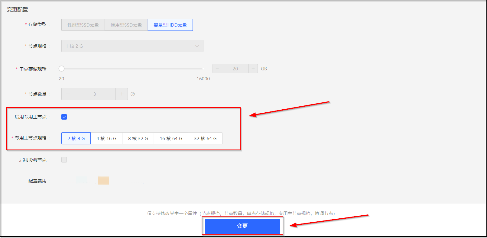

# 专有主节点

专有主节点的主要功能是对集群进行操作，如创建或删除索引，跟踪哪些节点是集群的一部分，并决定哪些分片分配给相关的节点。稳定的主节点对集群的健康非常重要，默认情况下集群中的任何一个节点都可能被选为主节点。索引数据和搜索查询等操作会占用大量的CPU、内存和IO资源，为了确保集群的稳定性，建议您购买专有主节点，分离主节点和数据节点。
京东云搜索Elasticsearch支持设置专用主节点来提高集群的稳定性，您可以通过下列方式设置专有主节点，购买或者升配后，系统将按照对应规格的价格进行计费。各规格的价格详情，请参见 [产品定价](../../../Pricing/Price-Overview.md)
- [创建集群](Dedicated-master-node#create-instace) 时
- [变更配置](Dedicated-master-node#config-instace) 时

## 专有主节点参数
| 参数 | 说明 |
| :-- | :-- |
| 专有主节点 | 对单可用区实例默认为未开启状态，支持更改; 对多可用区实例默认为开启状态，不可更改。
| 规格 | 2核8G、4核16G、8核32G、16核64G、32核64G |
| 专有主节点数量 | 默认为3个，暂不可更改 |
| 专有主节点存储类型 | 性能型SSD云盘 |
| 专有主节点存储空间 | 20GB，暂不可更改 |

## 创建集群时启用专有主节点

1. 访问 [云搜索Elasticsearch控制台](https://es-console.jdcloud.com/clusters)，进入集群管理页面。或访问 [京东云控制台](https://console.jdcloud.com/)，点击顶部导航栏 互联网中间件-云搜索Elasticsearch，进入集群管理页。

3. 选择您要创建实例的**区域**后，单击 **创建** 按钮，进入 **创建集群** 页面。

3. 创建集群的参数配置可参见 [创建集群](../../../Getting-Started/Create-ES.md)，请开启**启用专有主节点**开关、选择专有主节点规格类型：

4. 选择完参数后单击 **创建** 按钮。
5. 在**订单确认**页，选择 **已阅读并同意《云搜索Elasticsearch服务条款》**，单击 **立即开通** 按钮确认订单并创建云搜索Elasticsearch集群。

## 变更配置时启用专有主节点

1. 访问 [云搜索Elasticsearch控制台](https://es-console.jdcloud.com/clusters)，进入集群管理页面。或访问 [京东云控制台](https://console.jdcloud.com/)，点击顶部导航栏 互联网中间件-云搜索Elasticsearch，进入集群管理页。
2. 在您要启用专有主节点的集群，选择 【操作-更多-变更配置】。
3. 在变更配置页面，请开启**启用专有主节点**开关、选择专有主节点规格类型，确认参数后，单击 **创建** 按钮：

4. 在**订单确认**页，选择 **已阅读并同意《云搜索Elasticsearch服务条款》**，单击 **立即开通** 按钮确认订单并启用专有主节点。

