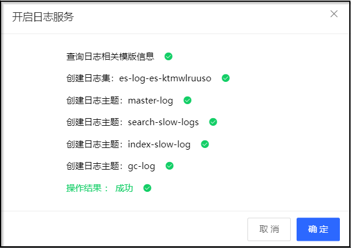

# Elasticsearch日志
云搜索Elasticsearch通过京东云日志服务提供Elasticsearch日志的查询和展示，日志类型包括主日志、搜索慢日志、索引慢日志、GC日志的查询和展示，各类型日志的日志内容主要由time、content 组成。您可以通过输入关键字和设置时间范围，筛选出需要查询的日志内容，快速定位集群问题，辅助集群运维。 

- Time：日志的产生时间。 
- Content：日志具体内容。 

## 前提条件
- 已开通了京东云的日志服务。 
- 已创建了云搜索Elasticsearch集群实例。 

## 操作步骤
1. 登陆 [京东云Elasticsearch控制台](https://es-console.jdcloud.com/clusters)。 
2. 在集群管理页，单击 **集群名称** 进入集群详情页。  
3. 选择 **日志服务** 页签。日志服务开关，默认关闭，关闭状态下日志服务未生效。您可切换开/关状态以打开或关闭Elasticsearch日志服务功能。 
 
4. 日志服务开关打开时，日志服务生效，系统会自动在京东云日志服务创建日志集es-log-{ClusterID}和4种日志主题：主日志（master-log）、索引慢日志（index-slow-log）、搜索慢日志（search-slow-log）、GC日志（gc-log）；日志服务开关关闭后，系统将删除自动创建的日志集和日志主题。 
 
5. 主日志、搜索慢日志、索引慢日志、GC日志4种日志内容均最长可支持近7天日志查询，点击日志内容展示日志上下文。 
 

## 日志说明

