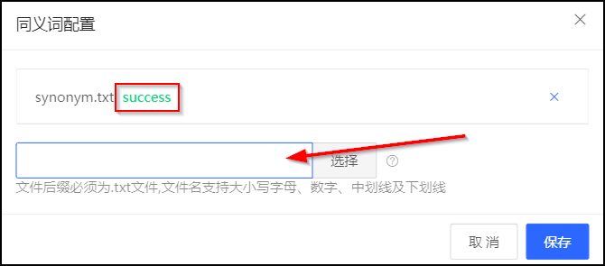

# 同义词配置

在通过同义词文件方式使用同义词时，您需要先上传同义词文件。
* [上传同义词文件](synonymdic#synonym-upload)
* [使用同义词](synonymdic#synonym-use)
* [下载同义词文件](synonymdic#synonym-download)
* [更新同义词文件](synonymdic#synonym-update)
* [删除同义词文件](synonymdic#synonym-delete)

## 上传同义词文件

<div id="synonym-upload"></div>

### 注意事项
* 上传同义词文件前请确保集群处于正常状态，该操作将触发集群滚动重启，在重启过程中后台会进行同义词词典的下发，生效时长与集群规模、数据量及负载情况等有关，建议在业务低峰期操作。
* 如果集群索引存在副本分片且集群负载处于正常水平，一般情况下，在集群变更过程中可持续对外提供服务。
* 如果集群负载过高且索引没有副本，同时业务中存在大量的写入或查询场景，在集群变更过程中,业务可能会出现偶发的访问超时现象。建议在客户端访问机制中配置重试机制，以减少对业务的影响。
* 同义词文件要求每行一个同义词表达式（表达式支持 [Solr 规则](https://www.elastic.co/guide/en/elasticsearch/reference/current/analysis-synonym-tokenfilter.html#_solr_synonyms) 和 [WordNet 规则](https://www.elastic.co/guide/en/elasticsearch/reference/current/analysis-synonym-tokenfilter.html#_wordnet_synonyms)），并且文件需要为utf-8编码，扩展名为.txt。例如：
  ```
    elasticsearch,es => es
    中华人民共和国,中国 => 中国
  ```
* 同义词文件单个文件最大为5M，单次上传文件总大小不超过20M。
### 操作步骤
1. 登陆 [京东云Elasticsearch控制台](https://es-console.jdcloud.com/clusters)。
2. 在集群管理页，单击**集群名称**进入集群详情页。 
3. 选择**自定义词库**页签，在**同义词配置**区域，单击**配置同义词词库右侧的按钮**。

   

4. 在弹出的**同义词配置**页面，选择要上传的同义词文件。

   

5. 如果选择的同义词文件校验成功（在同义词词库文件名邮件显示**绿色的success**），可单击**保存**。该操作将触发集群滚动重启。

   

## 同义词文件下载

<div id="synonym-download"></div>

说明：如果您需要获取已经上传过的词库文件，可直接单击对应文件的**下载**按钮进行下载。

   
   

## 使用同义词

<div id="synonym-use"></div>

### 同义词文件配置
等待实例的状态变为正常后，登录Kibana控制台创建索引、校验同义词，并上传测试数据进行搜索测试。**创建索引时需要配置settings和mapping，并且需要在settings中配置"synonyms_path": "synonym/your_dict_name.txt"**。

以下实例使用 filter 过滤器配置同义词，使用synonym.txt作为测试文件，文件内容为elasticsearch,es => es。
1. 在**集群管理**页，选择已上传同义词文件的集群右侧的**kibana**按钮，进入Kibana控制台。
2. 单击左侧导航栏的 **Dev Tools**。
3. 在**Console**中执行如下的命令，创建索引。
   ```
   PUT /my_index
   {
     "settings": {
       "index": {
         "analysis": {
           "analyzer": {
             "my_ik": {
               "type": "custom",
               "tokenizer": "ik_smart",
               "filter": [
                 "my_synonym"
               ]
             }
           },
           "filter": {
             "my_synonym": {
               "type": "synonym",
               "synonyms_path": "synonym/synonym.txt"
             }
           }
         }
       }
     },
     "mappings": {
        "properties": {
          "content": {
            "type": "text",
            "analyzer": "my_ik",
            "search_analyzer": "my_ik"
          }
        }
     }
   }
   ```
4. 执行如下命令，验证同义词配置。
   ```
   GET /my_index/_analyze
   {
     "analyzer": "my_ik",
     "text":"JD elasticsearch service"
   }
   ```
   命令执行成功，将返回如下结果。
   ```
   {
      "tokens" : [
      {
         "token" : "jd",
         "start_offset" : 0,
         "end_offset" : 2,
         "type" : "ENGLISH",
         "position" : 0
       },
       {
         "token" : "es",
         "start_offset" : 3,
         "end_offset" : 16,
         "type" : "SYNONYM",
         "position" : 1
       },
       {
         "token" : "service",
         "start_offset" : 17,
         "end_offset" : 24,
         "type" : "ENGLISH",
         "position" : 2
       }
     ]
   }
   ```
   输出结果中，token es的类型是SYNONYM同义词。
5. 执行如下命令，添加一些文档。
   ```
   POST /my_index/_doc/1
   {
     "content": "JD elasticsearch service"
   }
   POST /my_index/_doc/2
   {
      "content": "Hi es"
   }
   ```
   执行如下命令，搜索同义词。
   ```
   GET my_index/_search
   {
     "query" : { "match" : { "content" : "es" }}
   }
   ```
   命令执行成功后，返回如下结果。
   ```
   {
     "took" : 411,
     "timed_out" : false,
     "_shards" : {
       "total" : 1,
       "successful" : 1,
       "skipped" : 0,
       "failed" : 0
     },
     "hits" : {
       "total" : {
         "value" : 2,
         "relation" : "eq"
       },
       "max_score" : 0.19856803,
       "hits" : [
         {
           "_index" : "my_index",
           "_type" : "_doc",
           "_id" : "2",
           "_score" : 0.19856803,
           "_source" : {
             "content" : "Hi es"
           }
         },
         {
           "_index" : "my_index",
           "_type" : "_doc",
           "_id" : "1",
           "_score" : 0.16853255,
           "_source" : {
             "content" : "JD elasticsearch service"
           }
         }
       ]
     }
   }
   ```

## 更新同义词文件

<div id="synonym-update"></div>

### 注意事项
* 假设现存索引使用了synonym.txt同义词文件，当synonym.txt文件内容变更并重新上传后，现存索引不会动态加载更新后的同义词词典。请在同义词词典内容发生变化后进行**索引重建（reindex）操作**，否则可能会造成只有新增数据使用新词典的情况。
* 更新同义词文件前请确保集群处于正常状态，该操作将触发集群滚动重启，在重启过程中后台会进行同义词词典的下发，生效时长与集群规模、数据量及负载情况等有关，建议在业务低峰期操作。
* 如果集群索引存在副本分片且集群负载处于正常水平，一般情况下，在集群变更过程中可持续对外提供服务。
* 如果集群负载过高且索引没有副本，同时业务中存在大量的写入或查询场景，在集群变更过程中,业务可能会出现偶发的访问超时现象。建议在客户端访问机制中配置重试机制，以减少对业务的影响。
1. 登陆 [京东云Elasticsearch控制台](https://es-console.jdcloud.com/clusters)。
2. 在集群管理页，单击**集群名称**进入集群详情页。 
3. 选择**自定义词库**页签，在**同义词配置**区域，单击**配置同义词词库右侧的按钮**。

   

4. 在弹出的**同义词配置**页面，选择要删除的同义词文件（与下一步要上传的文件同名）。

   

5. 在**同义词配置**页面选择要上传的同义词文件。如果选择的同义词文件校验成功（在同义词词库文件名邮件显示**绿色的success**），可单击**保存**。

   

## 删除同义词文件

<div id="synonym-delete"></div>

### 注意事项
* 请谨慎选择删除同义词文件。在删除同义词文件之前，**请确保在所有已经配置过该同义词文件的索引的索引配置中，已经删除了该同义词文件的相关配置**。否则在删除同义词文件后的集群滚动重启时，可能将导致集群启动异常。

